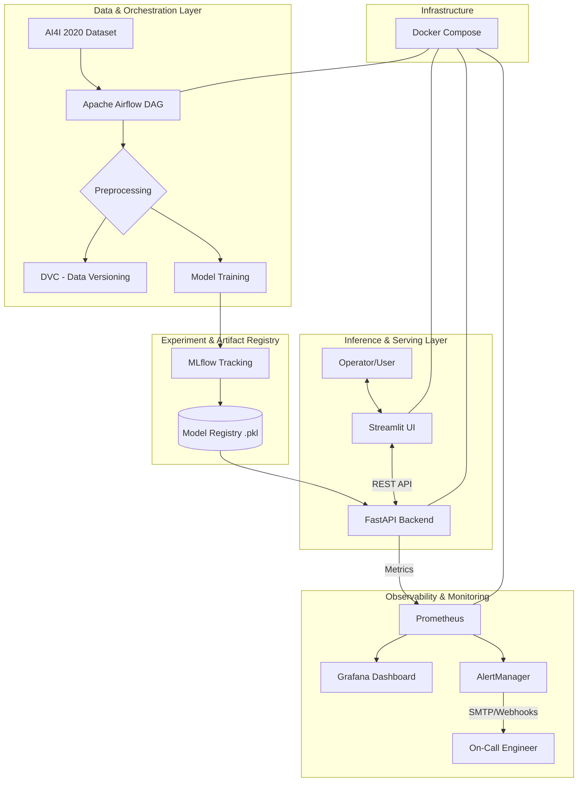

#  System Architecture

This diagram illustrates the end-to-end flow from data ingestion to real-time monitoring, highlighting the loose coupling between the inference engine and the frontend UI.

---

## Detailed Block Explanation

### 1. Data & Orchestration Layer

- **AI4I 2020 Dataset** — The source of truth containing 10,000 rows of industrial sensor data.
- **Apache Airflow** — The "brain" of the data engineering pipeline. It schedules the DAGs that handle automated data ingestion and trigger the training jobs.
- **DVC (Data Version Control)** — Acts as Git for data. It ensures that for every model version, we know exactly which dataset was used to train it, satisfying the Reproducibility requirement.

---

### 2. Experiment & Artifact Registry

- **MLflow Tracking** — Records every hyperparameter (like `n_estimators`) and metric (like `F1-score`). It ensures we don't lose track of our best-performing models.
- **Model Registry** — The storage for our serialized `.pkl` files. The FastAPI backend pulls the `Production`-tagged model from here.

---

### 3. Inference & Serving Layer

- **FastAPI Backend** — A lightweight, high-performance REST API. It is loosely coupled from the UI, meaning the model logic can be updated without touching the frontend code. It includes `/health` and `/ready` endpoints for system orchestration.
- **Streamlit UI** — The frontend designed for non-technical users. It provides a "foolproof" interface with sliders and file uploaders to interact with the model.

---

### 4. Observability & Monitoring

- **Prometheus** — A time-series database that "scrapes" the FastAPI backend for real-time metrics, such as inference latency and error counts.
- **Grafana** — The visual layer. It queries Prometheus to show real-time health graphs and model performance trends.
- **AlertManager** — The safety net. It triggers alerts (like the 5% error rate rule) to notify engineers if the system degrades.

---

### 5. Infrastructure (The Docker Umbrella)

- **Docker Compose** — Orchestrates the multi-container environment. It ensures that the PostgreSQL database, Airflow workers, FastAPI server, and UI all share the same network and environment settings (Environment Parity).