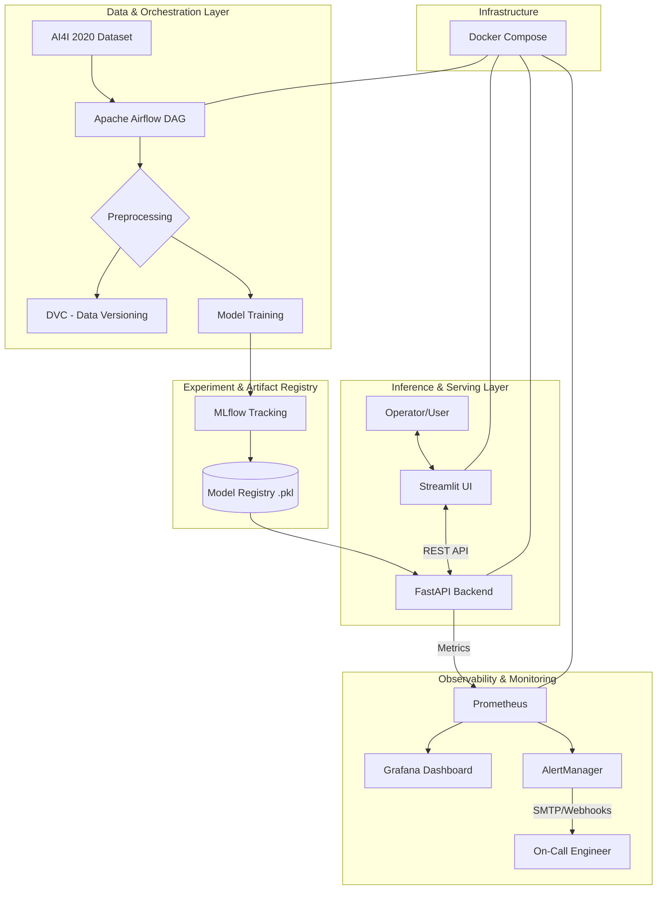

# High-Level Design (HLD) Document

---

## 1. Problem Statement & Scope

The objective is to transform reactive industrial maintenance into **Predictive Maintenance**. Using the **AI4I 2020 dataset**, the system classifies machine health into six categories *(No Failure, Power Failure, Tool Wear Failure, etc.)*. The scope includes:

- Automated data ingestion
- Versioned experimentation
- Containerized deployment
- Real-time observability

---

## 2. Design Rationale & Choices

### Choice A: Multi-Container Microservice Architecture

**Decision:** Using Docker Compose to orchestrate separate services for API, UI, Database, and Monitoring.

**Rationale:** To satisfy the **Environment Parity** and **Loose Coupling** requirements. By isolating the inference engine (FastAPI) from the presentation layer (Streamlit), we ensure that:
- A UI crash does not affect model availability
- The model can be updated independently of the frontend

---

### Choice B: FastAPI over Flask

**Decision:** FastAPI was selected as the backend framework.

**Rationale:**
- **Asynchronous Support** — Better throughput for concurrent inference requests.
- **Pydantic Validation** — Native data validation ensures that malformed sensor data is rejected before reaching the model *(Foolproof Design)*.
- **Auto-Documentation** — Automatic Swagger/OpenAPI generation simplifies the Handover/Testing process.

---

### Choice C: DVC (Data Version Control)

**Decision:** Implementing DVC for data and model tracking.

**Rationale:** Git is not designed for large binary files (models/datasets). DVC allows us to link a specific version of the trained model to a specific Git commit hash, ensuring **100% Reproducibility** of any experiment.

---

### Choice D: Prometheus-Pull Monitoring

**Decision:** A pull-based monitoring system using Prometheus.

**Rationale:** In a production environment, "pushing" metrics can overwhelm a server. Prometheus "pulls" (scrapes) data from the API at set intervals, ensuring that the monitoring stack does not degrade the performance of the inference engine.

---

---

# 🛠️ Low-Level Design (LLD) Document

---

## 1. Data Schema & Feature Engineering

The model expects a standardized input vector of **5 primary features** derived from the AI4I dataset:

| Feature | Range |
| :--- | :--- |
| Air Temperature [K] | 295.1 to 304.5 |
| Process Temperature [K] | 305.7 to 313.8 |
| Rotational Speed [rpm] | 1168 to 2886 |
| Torque [Nm] | 3.8 to 76.6 |
| Tool Wear [min] | 0 to 253 |

---

## 2. API Endpoint Specifications

### Endpoint 1: `/predict`

**Method:** `POST`

**Description:** Performs real-time classification of machine state.

#### Request Body (Input Specification)

| Field | Type | Description | Unit |
| :--- | :--- | :--- | :--- |
| `air_temp` | float | Ambient temperature | Kelvin (K) |
| `process_temp` | float | Internal machine temp | Kelvin (K) |
| `rotational_speed` | int | Spindle speed | RPM |
| `torque` | float | Applied torque | Nm |
| `tool_wear` | int | Usage time of tool | Minutes |
| `client_id` | string | ID for tracking | N/A |

#### Response Body (Output Specification)

| Field | Type | Description |
| :--- | :--- | :--- |
| `prediction` | string | The failure type (e.g., `"Heat Dissipation Failure"`) |
| `confidence` | float | Probability score of the prediction |
| `inference_time` | float | Time taken in seconds |
| `status` | int | HTTP Status Code (`200` for Success) |

---

### Endpoint 2: `/health`

**Method:** `GET`

**Description:** Liveness probe for Docker/Orchestrator.

**Output:**
```json
{
  "status": "healthy",
  "uptime": "..."
}
```

---

### Endpoint 3: `/ready`

**Method:** `GET`

**Description:** Readiness probe; verifies the ML model is loaded in memory.

**Output:**
```json
{
  "status": "ready"
}
```

---

### Endpoint 4: `/metrics`

**Method:** `GET`

**Description:** Scrape target for Prometheus.

**Output:** Standard Prometheus text format.

```
api_inference_count_total 42
```

---

## 3. Component Interaction Diagram



---

## 4. Implementation Adherence

- **Exception Handling** — All endpoints are wrapped in `try-except` blocks. If the model fails to load, the `/ready` endpoint will return a `503 Service Unavailable`, preventing the UI from sending requests to a broken backend.

- **Logging** — The system utilizes Python's `logging` module to record every prediction and error into a volume-mounted `/logs` directory, ensuring persistence even if the container restarts.